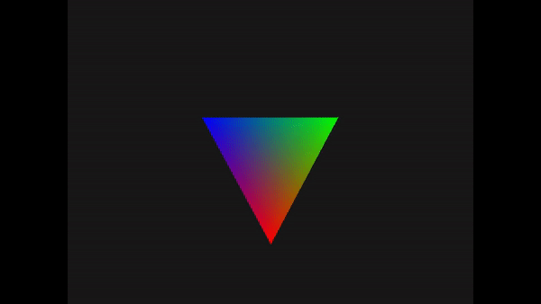

# graphics-demos

Demo examples for some of my [math-writeups](https://github.com/Zermil/math-writeups) using [SDL2](https://www.libsdl.org/)

## Instructions

 `[SPACE]` - Pause/Resume  
 `[ESC]/[Q]` - Exit

## Preview

### Barycentric coordinates
 

### Rectangles 


## Compile/Build

```console
> build.bat
```

## Run

```console
> cd build
> [DEMO NAME].exe
```